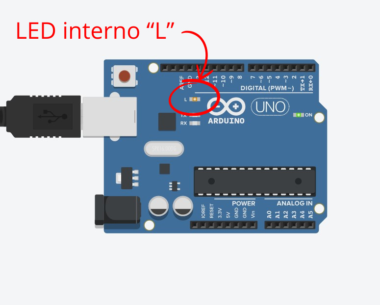
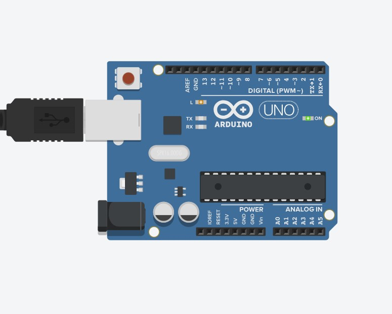
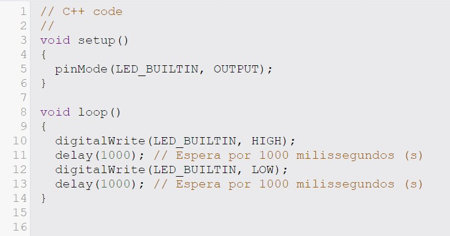

# Parte 1 Blink Led Interno Arduino

Este repositório contém um projeto para simular um circuito e código no TinkerCAD que faz o LED interno de um Arduino piscar a cada 1000 milissegundos (1 segundo). O código utiliza a função digitalWrite para alternar o estado do LED entre ligado e desligado, com um intervalo de 1 segundo entre cada mudança.

### Arduino no TinkerCad
Aqui está uma demonstração do LED 'L' no TinkerCAD que pisca a cada 1 segundo.
<div align="center">
    
    <br>
    <sup>Imagem do Arduino 1 - Fonte: TinkerCAD</sup>
</div>

<div align="center">
    
    <br>
    <sup>Imagem do Arduino 2 - Fonte: TinkerCAD</sup>
</div>

### Imagem do Código
Aqui está o código no TinkerCAD:
<div align="center">
    
    <br>
    <sup>Imagem do Código- Fonte: TinkerCAD</sup>
</div>

### Código
Aqui está o código:
``` C
// C++ code
//
void setup()
{
  pinMode(LED_BUILTIN, OUTPUT);
}

void loop()
{
  digitalWrite(LED_BUILTIN, HIGH);
  delay(1000); // Espera por 1000 milissegundos (s)
  digitalWrite(LED_BUILTIN, LOW);
  delay(1000); // Espera por 1000 milissegundos (s)
}
```

### Testando Protótipo